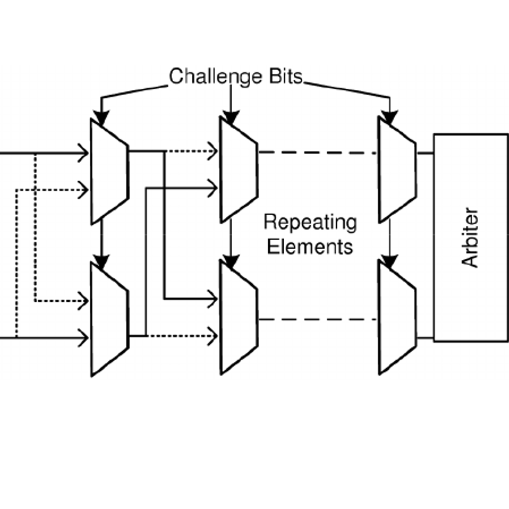

<!-- PROJECT LOGO -->
<br />
<p align="center">
  <a href="https://www.researchgate.net/figure/The-Arbiter-PUF-structure_fig1_228851018">
    
  </a>

  <h3 align="center">Machine Learning Attack on Arbiter PUF</h3>
  <p align="center">
    by: Justin Schubeck, Alex Liu, Yash Bhat
  </p>
</p>

## University of Florida : [Electrical and Computer Engineering](https://www.ece.ufl.edu/)<br />EEE5716 - Introduction to Hardware Security and Trust Fall 2022
Faculty: [Dr. Fahahmandi](https://www.ece.ufl.edu/people/faculty/farimah-farahmandi/) <br />
[Dr. Tehranipoor](https://www.ece.ufl.edu/people/faculty/mark-m-tehranipoor/) <br />
Students: [Justin Schubeck](https://www.linkedin.com/in/justinschubeck/) <br />
[Alex Liu](https://www.linkedin.com/in/alex-liu-m1/) <br />
[Yash Bhat](https://www.linkedin.com/in/yash-bhat/)


<!-- TABLE OF CONTENTS -->
<details open="open">
  <summary>Table of Contents</summary>
  <ol>
    <li>
      <a href="#about-the-project">About The Project</a>
    </li>
    <li>
      <a href="#getting-started">Getting Started</a>
      <ul>
        <li><a href="#dependencies">Dependencies</a></li>
        <li><a href="#installation">Installation</a></li>
        <li><a href="#running">Running</a></li>
      </ul>
    </li>
    <li><a href="#authors">Authors</a></li>
    <li><a href="#acknowledgements">Acknowledgements</a></li>
  </ol>
</details>


<!-- ABOUT THE PROJECT -->
## About The Project
This project consists of implementing both regression and classification machine learning algorithms to classify and predict attributes on supermarket sales datasets. The dataset for this project consisted of 1000 different purchases, having 16 different attributes tied to that checkout. The attributes were invoice ID, supercenter branch, city, customer type, customer gender, product line of items, unit price, quantity of items, total, date, time, payment method, cost of goods sold, grocc margin percentage, gross income, and customer satisfaction rating. 

The data was then split into 80% training and 20% testing. The below project will demonstrate how the models were trained, tested, and analyzed.

<!-- GETTING STARTED -->
## Getting Started

### Dependencies
This project was run in the UFRC Python-3.10 kernel on HiPerGator.

* NumPy 1.22.4
* Pandas 1.4.3
* Sklearn 1.1.2
* Scipy 1.8.1
* Matplotlib 3.5.2

### Installation

1. Clone the repo
   ```sh
   git clone https://github.com/UF-Applied-ML-Systems-F22/project-1-justinschubeck.git
   ```
2. Setup (and activate) your environment

### Running
**No additional actions should have to be taken by the user in order for the program to run successfully.**

**File Descriptions**
* ```supermarket_sales.csv```: This is the original input data.
* ```Training.ipynb```: This file will preprocess the data, perform grid search and cross validation, train the final models, evaluate the performance in CV and training, then save the final model to be used for the test set. 
* ```Training.pdf```: A visual copy of ```Training.ipynb``` results in pdf form.
* ```supermarket_test_prepared.csv```: This is the preprocessed test set. All respective features were scaled and encoded once. Each individual model will then drop the target values from this one set of data. 
* ```problem2a.pkl```: Multiple Linear Regression model without Regularization to predict ```gross income```.
* ```problem2b.pkl```: Multiple Linear Regression model with Lasso Regularization to predict ```gross income```.
* ```problem3a.pkl```: Multiple Linear Regression model without Regularization to predict ```Unit price```.
* ```problem3b.pkl```: Multiple Linear Regression model with Lasso Regularization to predict ```Unit price```.
* ```problem4.pkl```: Logistic Regression model with 2nd Order Interactions to classify ```Gender```.
* ```problem5.pkl```: Logistic Regression model with 2nd Order Interactions to classify ```Customer type```.
* ```problem6a.pkl```: Random Forest model to classify ```Day of Week```.
* ```problem6b.pkl```: Logistic Regression multi-class model to classify ```Day of Week```.
* ```Test.ipynb```: This file loads in the testing dataset and the model files and performs evaluation on the test set. 
* ```Test.pdf```: A visual copy of ```Test.ipynb``` results in pdf form.
* ```Justin_Schubeck - Building_and_Evaluating_ML_Algorithms.pdf```: A pdf IEEE-format paper covering the project.

<!-- Authors -->
## Authors

* Justin Schubeck - jschubeck@ufl.edu
* Alex Liu - aliu1@ufl.edu
* Yash Bhat - bhat.yashasvi@ufl.edu

Project Link: [https://github.com/justinschubeck/ML-Attack-on-Arbiter-PUF](https://github.com/justinschubeck/ML-Attack-on-Arbiter-PUF)


<!-- ACKNOWLEDGEMENTS -->
## Acknowledgements

* [Catia Silva (readme template)](https://faculty.eng.ufl.edu/catia-silva/)

## Thank you